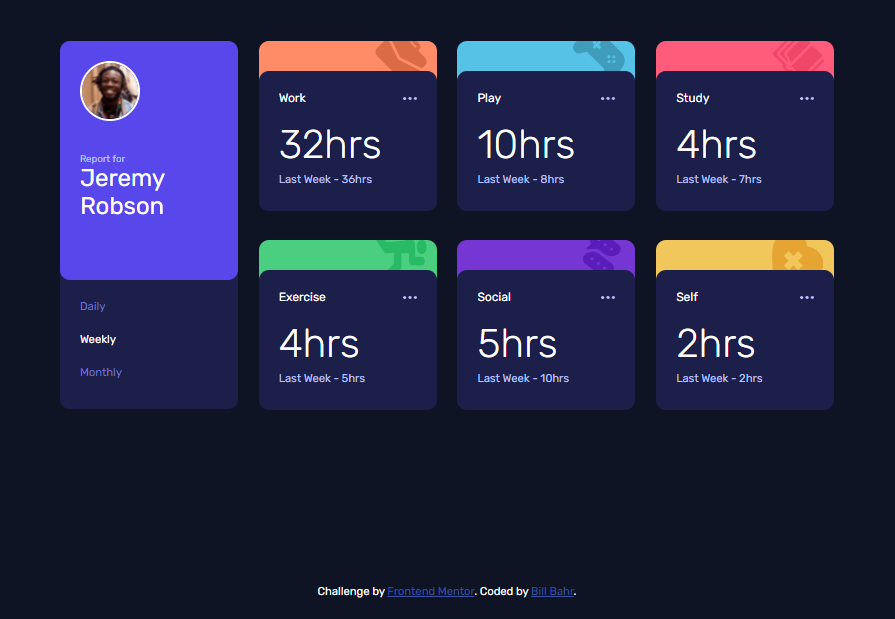

# Frontend Mentor - Time tracking dashboard solution

This is a solution to the [Time tracking dashboard challenge on Frontend Mentor](https://www.frontendmentor.io/challenges/time-tracking-dashboard-UIQ7167Jw). Frontend Mentor challenges help you improve your coding skills by building realistic projects. 

## Table of contents

- [Overview](#overview)
  - [The challenge](#the-challenge)
  - [Screenshot](#screenshot)
  - [Links](#links)
- [My process](#my-process)
  - [Built with](#built-with)
  - [What I learned](#what-i-learned)
  - [Useful resources](#useful-resources)
- [Author](#author)


## Overview

### The challenge

Users should be able to:

- View the optimal layout for the site depending on their device's screen size
- See hover states for all interactive elements on the page
- Switch between viewing Daily, Weekly, and Monthly stats

### Screenshot




### Links

- [Solution website](https://billbahr.github.io/time-tracking-dashboard/)

## My process

### Built with

- Semantic HTML5 markup
- CSS
- CSS Grid
- Javascript

### What I learned
I'm sure there must be a way more efficient way to do this, but I'm excited I was able to load the data from the local json file, and I like how I setup this array and loop to get it into the html structure:

```js
const htmlData = new Array(6);
htmlData[0] = document.querySelectorAll('.work>div>p');
htmlData[1] = document.querySelectorAll('.play>div>p');
htmlData[2] = document.querySelectorAll('.study>div>p');
htmlData[3] = document.querySelectorAll('.exercise>div>p');
htmlData[4] = document.querySelectorAll('.social>div>p');
htmlData[5] = document.querySelectorAll('.self>div>p');

function loadData() {
    fetch("data.json")
    .then(response => {
        if (!response.ok) {
            throw new Error(`HTTP error ${response.status}`);
        }
        return response.json();
    })
    .then(data => {
        for (let i = 0; i < 6; i++) {
            htmlData[i].forEach(para => {
                if(para.classList.contains('daily')) {
                    if(para.classList.contains('big')) {
                        para.innerHTML = data[i].timeframes.daily.current + "hrs";
                    } else {
                        para.innerHTML = "Yesterday - " + data[i].timeframes.daily.previous + "hrs";
                    }
                }
                if(para.classList.contains('weekly')) {
                    if(para.classList.contains('big')) {
                        para.innerHTML = data[i].timeframes.weekly.current + "hrs";
                    } else {
                        para.innerHTML = "Last Week - " + data[i].timeframes.weekly.previous + "hrs";
                    }
                }
                if(para.classList.contains('monthly')) {
                    if(para.classList.contains('big')) {
                        para.innerHTML = data[i].timeframes.monthly.current + "hrs";
                    } else {
                        para.innerHTML = "Last Month - " + data[i].timeframes.monthly.previous + "hrs";
                    }
                }                        
            })
        }
    })
    .catch(error => {
        console.log(error);
    });
}
```

### Useful resources

- [CSS Tricks](https://css-tricks.com/) - As always, CSS Tricks was very useful for figuring out the CSS. I used it a lot for the Grid properties.


## Author

- Github - [billbahr](https://github.com/billbahr)
- Frontend Mentor - [@billbahr](https://www.frontendmentor.io/profile/billbahr)
- Twitter - [@billbahr](https://www.twitter.com/billbahr)
